# Robust AIGC Image Detector

A progressive, multi-stage deep learning pipeline for detecting AI-generated images. The system evolves through five model stages—from a simple CLIP-based baseline to a transformation-aware detector with corruption estimation, reliability gating, and adaptive residual correction—each warm-starting from the previous stage's best checkpoint.

---

## Table of Contents

1. [Project Overview](#1-project-overview)
2. [Architecture at a Glance](#2-architecture-at-a-glance)
3. [Directory Structure](#3-directory-structure)
4. [Configuration System](#4-configuration-system)
5. [Datasets & Manifest Pipeline](#5-datasets--manifest-pipeline)
6. [Model Architecture (5 Stages)](#6-model-architecture-5-stages)
7. [Forensic Feature Extraction](#7-forensic-feature-extraction)
8. [Augmentation & Corruption Pipeline](#8-augmentation--corruption-pipeline)
9. [Training System](#9-training-system)
10. [Evaluation & Robustness Benchmarking](#10-evaluation--robustness-benchmarking)
11. [Calibration System](#11-calibration-system)
12. [Inference Engine](#12-inference-engine)
13. [Script Reference](#13-script-reference)
14. [Dependencies](#14-dependencies)

---

## 1. Project Overview

This project builds a **robust binary classifier** that determines whether an image is **real (label 0)** or **AI-generated (label 1)**. The key innovation is **progressive stage-wise training**: each model stage inherits the learned weights of the previous stage and adds new capabilities, allowing the system to start simple and gradually become robust to real-world image transformations (JPEG compression, resizing, blurring, noise, color jitter, cropping) and adversarial "laundering" pipelines.

### Core Design Principles

- **Frozen CLIP backbone** — `openai/clip-vit-large-patch14` provides semantic image embeddings; only lightweight adapter/classifier heads are trained.
- **Paired-view consistency training** — Every training sample produces a clean + corrupted pair; consistency losses enforce feature and prediction stability.
- **Forensic signal fusion** — Hand-crafted frequency-domain features (FFT, DCT, wavelet, high-pass residual) are fused with CLIP semantic embeddings.
- **Native tile analysis** — Images are decomposed into spatial tiles, each processed by a forensic encoder, then pooled via learned attention.
- **Corruption awareness** — A corruption estimator predicts the type and severity of degradation, feeding a reliability gate that dynamically re-weights semantic vs. forensic branches.
- **Calibration** — Temperature scaling and a logistic-regression reliability calibrator produce well-calibrated, trustworthy probabilities.

---

## 2. Architecture at a Glance

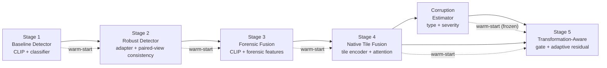

Each stage warm-starts from the previous stage's best checkpoint.

### Full System Data Flow

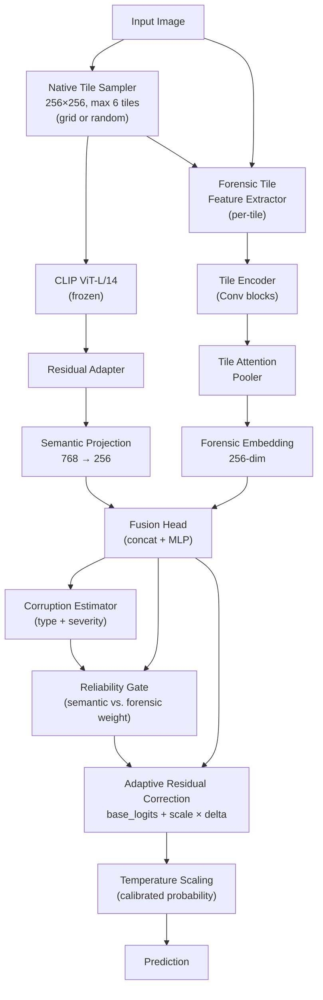

---

## 3. Directory Structure

```
Techjam_copy/
├── configs/
│   └── base.yaml                  # Central YAML configuration
├── data/
│   ├── manifests/                 # CSV manifests (train/val/test splits)
│   │   ├── cifake_train.csv
│   │   ├── cifake_val.csv
│   │   ├── cifake_test.csv
│   │   ├── cifake_all.csv
│   │   ├── cifake_cross_split_duplicates.csv
│   │   └── sid_val.csv
│   ├── raw/                       # Raw downloaded datasets (gitignored)
│   ├── processed/                 # Materialized images (gitignored)
│   └── benchmark/                 # Evaluation benchmark outputs
├── samples/
│   └── inference_test/
│       ├── real.png               # Sample real image for inference
│       └── fake.png               # Sample fake image for inference
├── scripts/                       # 35 CLI entry-point scripts
│   ├── build_cifake_manifest.py
│   ├── build_sid_manifest.py
│   ├── build_sid_partitions.py
│   ├── build_unified_manifest.py
│   ├── download_sid_subset.py
│   ├── train_baseline.py
│   ├── train_robust.py
│   ├── train_forensic_fusion.py
│   ├── train_native_tile_fusion.py
│   ├── train_corruption_estimator.py
│   ├── train_transformation_aware.py
│   ├── evaluate_baseline.py
│   ├── evaluate_robust.py
│   ├── evaluate_forensic_fusion.py
│   ├── evaluate_native_tile.py
│   ├── evaluate_calibration.py
│   ├── evaluate_laundering.py
│   ├── evaluate_sid_ood.py
│   ├── evaluate_transformation_aware.py
│   ├── fit_calibration.py
│   ├── analyze_errors.py
│   ├── infer.py
│   ├── inspect_dataset.py
│   ├── inspect_sid_manifest.py
│   ├── test_baseline_model.py
│   ├── test_corruptions.py
│   ├── test_dataloader.py
│   ├── test_native_tiles.py
│   ├── test_paired_views.py
│   ├── visualize_corruptions.py
│   ├── visualize_forensic_features.py
│   ├── visualize_native_tiles.py
│   └── visualize_tile_attention.py
├── src/
│   ├── __init__.py
│   ├── utils/
│   │   ├── config.py              # YAML config loader
│   │   ├── device.py              # CUDA/MPS/CPU device selection
│   │   └── seed.py                # Reproducibility seeding
│   ├── models/
│   │   ├── clip_backbone.py
│   │   ├── baseline_detector.py
│   │   ├── residual_adapter.py
│   │   ├── robust_detector.py
│   │   ├── forensic_features.py
│   │   ├── forensic_encoder.py
│   │   ├── forensic_fusion_detector.py
│   │   ├── native_forensic_features.py
│   │   ├── native_tile_encoder.py
│   │   ├── tile_attention.py
│   │   ├── native_tile_fusion_detector.py
│   │   ├── corruption_estimator.py
│   │   ├── reliability_gate.py
│   │   └── transformation_aware_detector.py
│   ├── augmentations/
│   │   ├── corruption.py           # 6 corruption types
│   │   ├── pipeline.py             # CorruptionPipeline orchestrator
│   │   └── paired_views.py         # Clean/corrupted pair generator
│   ├── data/
│   │   ├── dataset.py              # AIGCImageDataset
│   │   ├── manifest.py             # Manifest build + stratified split
│   │   ├── image_utils.py          # Image loading/validation
│   │   ├── collate.py              # CLIP collator
│   │   ├── paired_collate.py       # Paired-view CLIP collator
│   │   ├── corruption_collate.py   # Corruption + CLIP collator
│   │   ├── corruption_training_dataset.py
│   │   ├── native_tiles.py         # NativeTileSampler
│   │   ├── native_tile_collate.py  # Tile + CLIP collator
│   │   ├── multisignal_collate.py  # Multi-signal collator
│   │   ├── balanced_sampler.py     # Class-balanced sampler
│   │   ├── sid_partition.py        # SID OOD partitioning
│   │   ├── unified_manifest.py     # Cross-dataset manifest
│   │   └── adapters/
│   │       ├── cifake.py           # CIFAKE dataset adapter
│   │       └── sid_set.py          # SID_Set HuggingFace adapter
│   ├── training/
│   │   ├── metrics.py              # Binary classification metrics
│   │   ├── trainer.py              # Stage 1 baseline trainer
│   │   ├── robust_trainer.py       # Stage 2 robust trainer
│   │   ├── forensic_trainer.py     # Stage 3 forensic fusion trainer
│   │   ├── native_tile_trainer.py  # Stage 4 native tile trainer
│   │   ├── corruption_trainer.py   # Corruption estimator trainer
│   │   ├── transformation_aware_trainer.py  # Stage 5 trainer
│   │   ├── checkpoint.py           # Per-stage checkpoint savers
│   │   ├── robust_checkpoint.py
│   │   ├── forensic_checkpoint.py
│   │   ├── native_tile_checkpoint.py
│   │   ├── corruption_checkpoint.py
│   │   ├── transformation_aware_checkpoint.py
│   │   └── corruption_targets.py   # Corruption type/severity labels
│   ├── evaluation/
│   │   ├── robustness.py           # Corruption robustness benchmark
│   │   ├── corruption_dataset.py   # On-the-fly corrupted eval dataset
│   │   ├── native_tile_robustness.py
│   │   ├── forensic_robustness.py
│   │   ├── laundering.py           # Multi-step laundering eval
│   │   ├── laundering_dataset.py
│   │   ├── error_analysis.py       # Error categorization + contact sheets
│   │   └── native_tile_robustness.py
│   ├── calibration/
│   │   ├── temperature_scaling.py  # LBFGS temperature optimization
│   │   ├── reliability.py          # 9-feature reliability calibrator
│   │   └── metrics.py              # ECE, reliability diagrams
│   └── inference/
│       ├── dataset.py              # Inference image dataset
│       └── predictor.py            # AIGCInferenceEngine
├── requirements.txt
└── README.md
```

---

## 4. Configuration System

All hyperparameters are centralized in `configs/base.yaml`. The config is loaded by `src/utils/config.py` and passed as a dictionary to every training/evaluation/inference script.

### Key Configuration Sections

| Section | Purpose |
|---|---|
| `project` | Project name and random seed (42) |
| `paths` | Directory paths for data, checkpoints, outputs |
| `datasets.cifake` | CIFAKE local paths, directory names, validation fraction |
| `datasets.sid_set` | HuggingFace repo ID, streaming settings, per-class quotas |
| `training` | Default batch size, epochs, LR, weight decay, gradient clipping, AMP |
| `model` | CLIP model name, backbone freezing, classifier dimensions |
| `robust_training` | Clean probability, adapter bottleneck, consistency loss weights |
| `forensic_fusion` | Warm-start checkpoint, forensic/fusion dims, differential LRs |
| `native_tiles` | Tile size (256), max tiles (6), attention/fusion dims, entropy loss |
| `corruption_estimator` | 7 corruption types, embedding dim, type/severity loss weights |
| `transformation_aware` | Gate dims, residual scale, differential LRs, gate reliability loss |
| `robustness.conditions` | 13 corruption conditions for benchmarking |
| `laundering.pipelines` | 8 multi-step laundering pipelines |
| `calibration` | Temperature iterations, reliability probes |
| `error_analysis` | Sample limits, thresholds, contact sheet layout |

### Device Selection

`src/utils/device.py` automatically selects the best available PyTorch device:

```
Priority: CUDA → MPS (Apple Silicon) → CPU
```

### Reproducibility

`src/utils/seed.py` seeds Python `random`, NumPy, and PyTorch (CPU + CUDA). cuDNN benchmark mode is enabled for performance; full determinism is not forced.

---

## 5. Datasets & Manifest Pipeline

The system supports two datasets, each with a dedicated adapter that scans directories, validates images, computes SHA-256 content hashes, and writes CSV manifests.

### CIFAKE Adapter (`src/data/adapters/cifake.py`)

CIFAKE is a local folder dataset with `train/` and `test/` splits, each containing `REAL/` and `FAKE/` subdirectories.

```text
data/raw/cifake/
├── train/
│   ├── REAL/    (60,000 images)
│   └── FAKE/    (60,000 images)
└── test/
    ├── REAL/    (10,000 images)
    └── FAKE/    (10,000 images)
```

**Manifest build flow:**

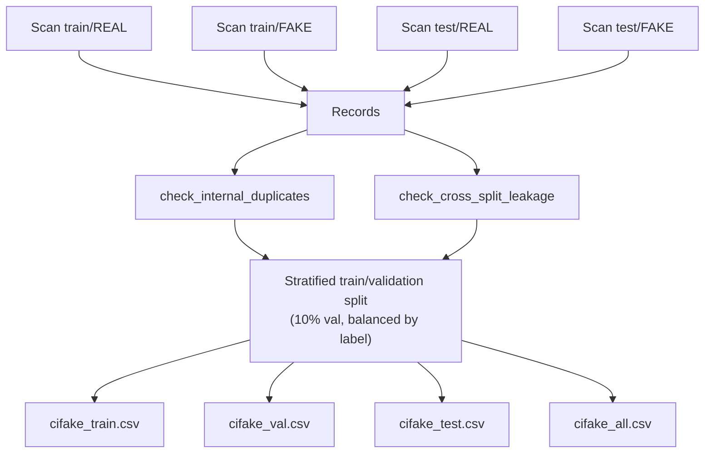

Key features:
- **Case-insensitive directory finding** — `REAL`, `Real`, `real` all work
- **SHA-256 content hashing** — detects exact duplicate images across splits
- **Cross-split leakage detection** — flags images appearing in both train and test
- **Stratified train/validation split** — preserves label balance

### SID_Set Adapter (`src/data/adapters/sid_set.py`)

SID_Set is a large HuggingFace dataset (`saberzl/SID_Set`) loaded via streaming to avoid downloading 100+ GB at once.

**Label mapping:**

| Original Label | Class | Scope | Source | Generator |
|---|---|---|---|---|
| 0 | real | real | openimages_v7 | none |
| 1 | fake | full_synthetic | sid_set | flux |
| 2 | fake | tampered | sid_set | latent_diffusion_tampering |

Label 2 (tampered) is excluded from the primary binary task by default (`include_tampered_auxiliary: false`).

**SID materialization flow:**

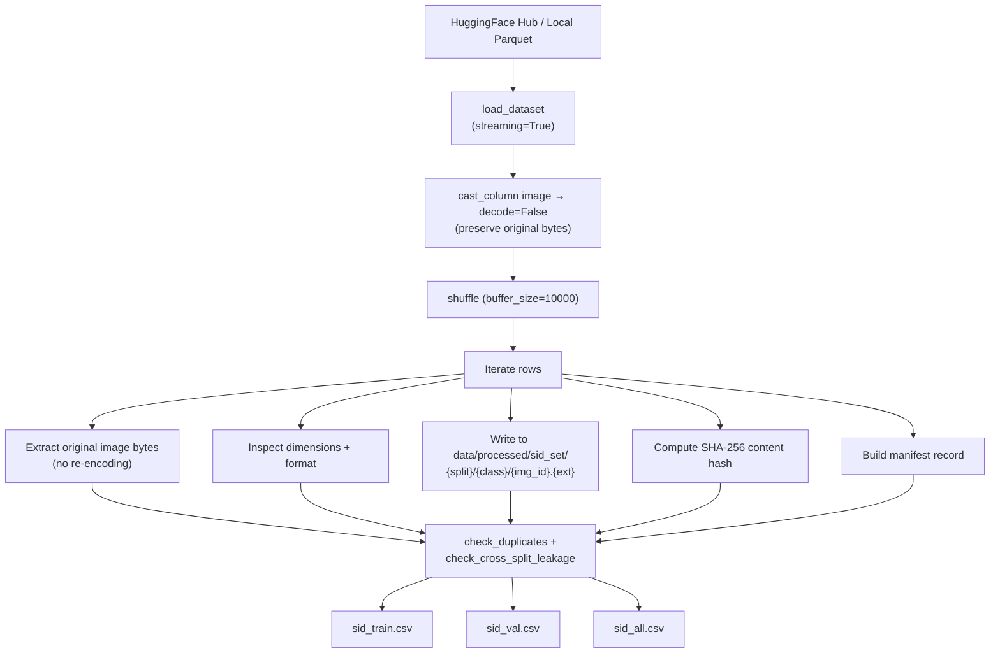

Key features:
- **Original byte preservation** — images are written without decode/re-encode
- **Per-class quotas** — `train_max_per_class: 10000`, `validation_max_per_class: 5000`
- **Streaming shuffle buffer** — approximate random sampling without full materialization
- **Atomic file writes** — temporary file + `shutil.move` prevents corruption

### Manifest Schema

Every manifest CSV contains these columns:

| Column | Description |
|---|---|
| `image_path` | Project-relative path to the image |
| `label` | 0 (real) or 1 (fake) |
| `class_name` | "real" or "fake" |
| `dataset` | "cifake" or "sid_set" |
| `source` | Data source identifier |
| `generator` | AI generator name (or "unknown"/"none") |
| `original_split` | Original dataset split |
| `split` | Assigned split: "train", "val", or "test" |
| `content_hash` | SHA-256 hash of image bytes |

### Dataset Class (`src/data/dataset.py`)

`AIGCImageDataset` is the core PyTorch `Dataset` that:
1. Reads a manifest CSV
2. Validates required columns
3. Loads images as RGB PIL Images
4. Applies either a standard transform or a paired transform (clean + corrupted)
5. Returns metadata (image_path, class_name, dataset, source, generator, etc.)

---

## 6. Model Architecture (5 Stages)

### Stage 1: Baseline Detector

**File:** `src/models/baseline_detector.py`
**Script:** `scripts/train_baseline.py`

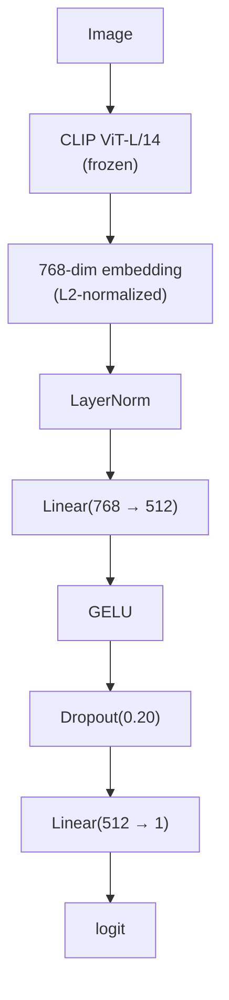

- CLIP backbone is frozen; only the classifier head trains
- L2-normalized embeddings
- BCEWithLogitsLoss
- Best checkpoint selected by validation AUROC

### Stage 2: Robust Detector

**File:** `src/models/robust_detector.py`
**Script:** `scripts/train_robust.py`
**Warm-start:** `checkpoints/baseline_best.pt`

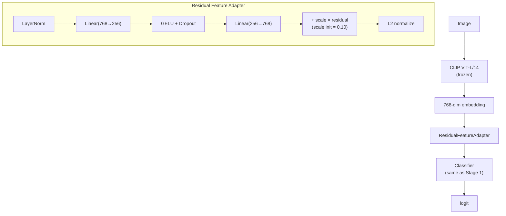

**Key additions:**
- **ResidualFeatureAdapter** (`src/models/residual_adapter.py`): bottleneck adapter with a learnable `residual_scale` (initialized to 0.10) that gradually modifies CLIP features without destroying the original representation
- **Paired-view training**: `forward_pair()` processes clean + corrupted images in a single batched pass through the backbone (efficiency optimization), then splits the output

**Loss function:**

```
L_total = L_classification
        + α · L_feature_consistency
        + β · L_prediction_consistency

where:
  L_classification     = 0.5 × (BCE(clean) + BCE(corrupted))
  L_feature_consistency = 1 - mean(cos_sim(f_clean, f_corrupted))
  L_prediction_consistency = MSE(σ(clean_logits), σ(corrupted_logits))

  α = 0.15  (feature_consistency_weight)
  β = 0.25  (prediction_consistency_weight)
```

**Validation metric:** `robust_score = (clean_AUROC + corrupted_AUROC) / 2`

### Stage 3: Forensic Fusion Detector

**File:** `src/models/forensic_fusion_detector.py`
**Script:** `scripts/train_forensic_fusion.py`
**Warm-start:** `checkpoints/robust_best.pt`

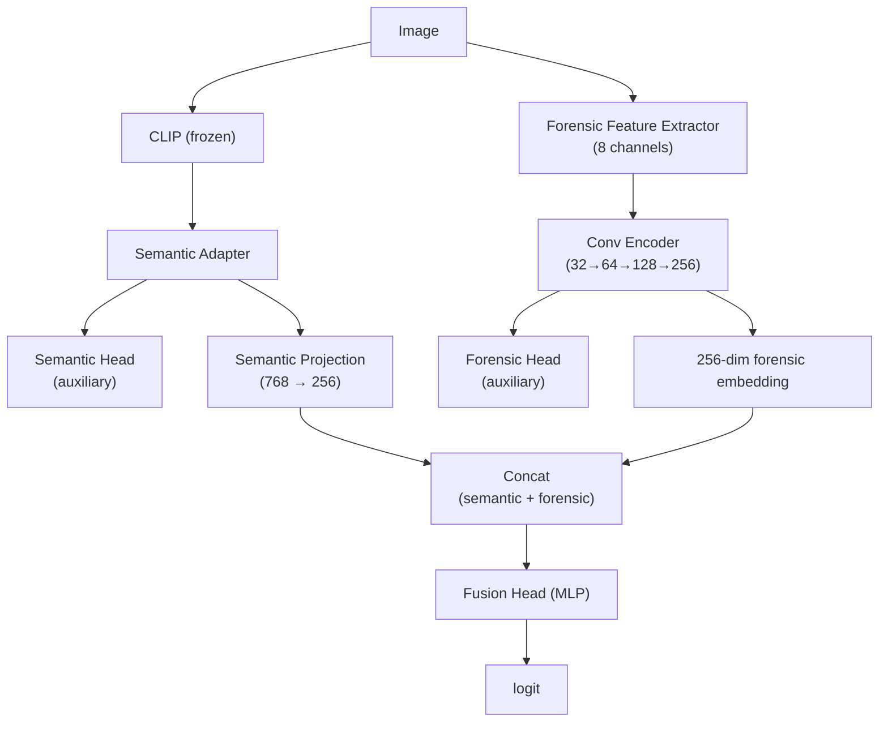

**Key additions:**
- **ForensicEncoder** (`src/models/forensic_encoder.py`): processes 8-channel forensic feature maps through 4 ConvForensicBlocks (32→64→128→256 channels, stride-2 downsampling), adaptive avg pool, then linear projection to 256-dim
- **Dual auxiliary heads**: semantic-only and forensic-only heads provide auxiliary supervision
- **Differential learning rates**: semantic branch at 0.0002, new forensic/fusion modules at 0.001

**Loss function:**

```
L_total = L_classification
        + 0.15 · L_auxiliary        (avg of 4 branch losses)
        + 0.10 · L_feature_consistency
        + 0.20 · L_prediction_consistency
```

### Stage 4: Native Tile Fusion Detector

**File:** `src/models/native_tile_fusion_detector.py`
**Script:** `scripts/train_native_tile_fusion.py`
**Warm-start:** `checkpoints/forensic_fusion_best.pt`

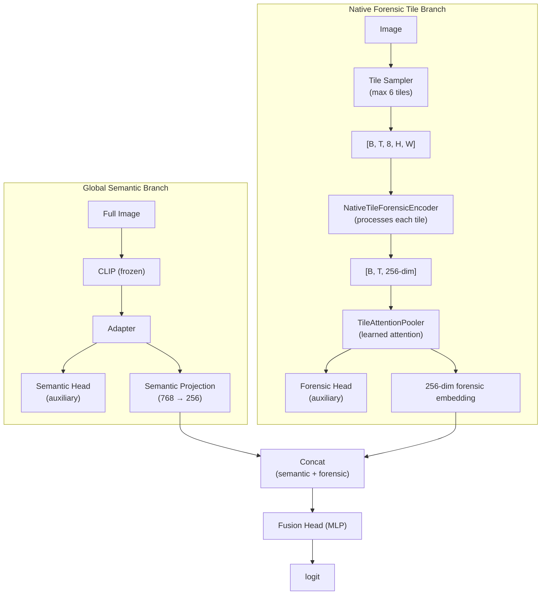

**Key additions:**
- **NativeTileSampler** (`src/data/native_tiles.py`): samples up to 6 tiles of 256×256 from each image. Two modes:
  - **Grid** (evaluation): deterministic grid layout based on aspect ratio
  - **Random** (training): seeded by `hash(seed|sample_key|sampling_token)`, always includes center tile
- **NativeTileForensicEncoder** (`src/models/native_tile_encoder.py`): flattens `[B, T, 8, H, W]` to `[B×T, 8, H, W]`, processes through shared Conv encoder, reshapes back to `[B, T, 256]`
- **TileAttentionPooler** (`src/models/tile_attention.py`): learns per-tile attention scores via `LayerNorm → Linear → Tanh → Linear(1)`, softmax over valid tiles, weighted sum of tile embeddings. Padded tiles receive zero attention.

**Loss function:**

```
L_total = L_classification
        + 0.10 · L_auxiliary
        + 0.08 · L_feature_consistency
        + 0.20 · L_prediction_consistency
        + 0.005 · L_attention_entropy    (prevents attention collapse)
```

### Stage 5: Transformation-Aware Detector

**File:** `src/models/transformation_aware_detector.py`
**Script:** `scripts/train_transformation_aware.py`
**Warm-start:** `checkpoints/native_tile_best.pt` + `checkpoints/corruption_estimator_best.pt`

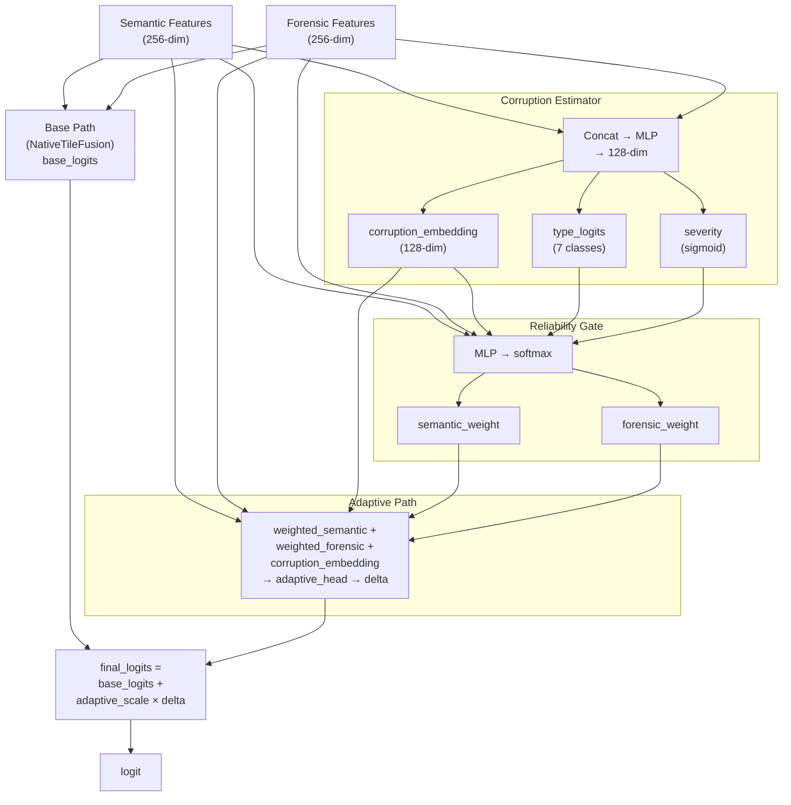

**Key additions:**
- **CorruptionEstimator** (`src/models/corruption_estimator.py`): takes semantic + forensic features, produces a 128-dim corruption embedding, then predicts corruption type (7-class: clean, jpeg, blur, resize, noise, color_jitter, crop) and severity (0-1 sigmoid)
- **ReliabilityGate** (`src/models/reliability_gate.py`): takes semantic + forensic + corruption embedding + type probabilities + severity, outputs softmax weights `[semantic_weight, forensic_weight]`
- **Adaptive residual correction**: `final_logits = base_logits + adaptive_scale × adaptive_delta`, where `adaptive_scale` starts at 0.05 to avoid disrupting the pre-trained base detector

**Loss function:**

```
L_total = L_classification
        + 0.05 · L_auxiliary
        + 0.05 · L_feature_consistency
        + 0.15 · L_prediction_consistency
        + 0.15 · L_gate_reliability    (teaches gate which branch is correct)
```

**Differential learning rates:**

| Module | Learning Rate |
|---|---|
| Semantic adapter + head | 0.00005 |
| Forensic encoder + head | 0.00010 |
| Tile attention | 0.00010 |
| Gate | 0.001 |
| Adaptive head | 0.001 |

---

## 7. Forensic Feature Extraction

The forensic branch relies on hand-crafted signal-processing features that capture pixel-level artifacts invisible to CLIP's semantic embeddings. Two extractors exist:

### ForensicFeatureExtractor (`src/models/forensic_features.py`)

Used by Stage 3 (whole-image forensic fusion). Produces **8 channels**:

| Channel(s) | Feature | Description |
|---|---|---|
| 0–2 | High-pass residual | `image - gaussian_blur(image)`, scaled ×4, clamped to [-1, 1] |
| 3 | FFT magnitude | Log-magnitude of 2D FFT, shifted, standardized |
| 4 | DCT | Full-image DCT, log-magnitude, DC suppressed, standardized |
| 5–7 | Haar wavelet | Horizontal, vertical, diagonal detail subbands |

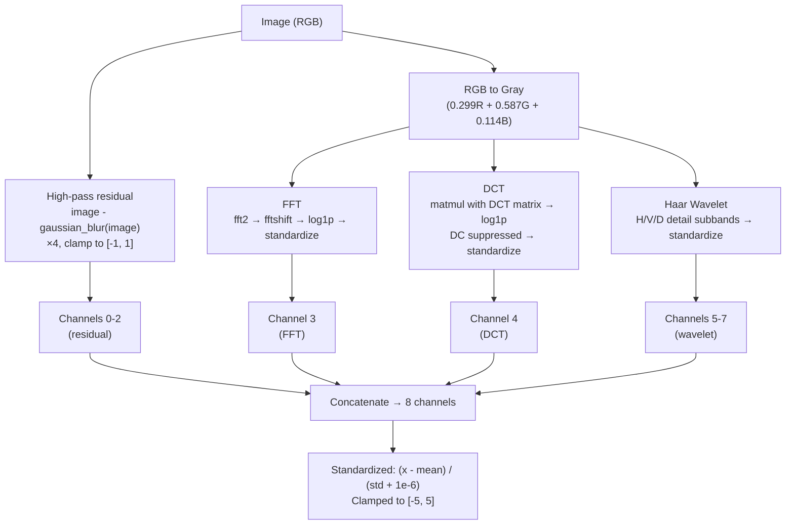

### NativeForensicFeatureExtractor (`src/models/native_forensic_features.py`)

Used by Stage 4+ (per-tile forensic). Nearly identical, but uses **block DCT** (8×8 blocks via `unfold`/`fold`) instead of full-image DCT, which better captures JPEG-style block artifacts.

### Conv Encoder Architecture

Both extractors feed into a shared `ConvForensicBlock` encoder:

```
ConvForensicBlock(8 → 32)           # no stride
ConvForensicBlock(32 → 64, stride=2)   # downsample ×2
ConvForensicBlock(64 → 128, stride=2)  # downsample ×4
ConvForensicBlock(128 → 256, stride=2) # downsample ×8
AdaptiveAvgPool2d(1)
Flatten → LayerNorm → Dropout → Linear(256 → 256) → GELU → LayerNorm
→ [256-dim forensic embedding]
```

Each `ConvForensicBlock` contains:
```
Conv2d(3×3, bias=False) → GroupNorm → GELU → Conv2d(3×3, bias=False) → GroupNorm → GELU
```

GroupNorm is used (instead of BatchNorm) because batch sizes can be small and tile-level statistics vary.

---

## 8. Augmentation & Corruption Pipeline

### Corruption Types

Six corruption types are implemented in `src/augmentations/corruption.py`, each returning a PIL Image + `CorruptionMetadata` dataclass:

| Type | Function | Parameters | Key Detail |
|---|---|---|---|
| `jpeg` | `apply_jpeg_compression` | quality: 90/70/50/30 | Save to BytesIO, reload |
| `blur` | `apply_gaussian_blur` | sigma: 0.5/1.0/2.0 | PIL GaussianBlur |
| `resize` | `apply_resize` | scale: 0.5/0.25 | Downscale then upscale (bicubic) |
| `noise` | `apply_gaussian_noise` | sigma: 0.02/0.05/0.10 | Additive Gaussian, clipped to [0, 255] |
| `color_jitter` | `apply_color_jitter` | brightness/contrast/saturation ±20% | PIL ImageEnhance |
| `crop` | `apply_center_crop` | ratio: 0.80 | Center crop then resize back |

All corruptions preserve original image dimensions.

### CorruptionPipeline (`src/augmentations/pipeline.py`)

Orchestrates corruption application with:
- `apply_specific(type, severity)` — deterministic single corruption
- `apply_random(clean_probability)` — random corruption or clean
- `apply_sequence([(type, severity), ...])` — multi-step pipeline (for laundering)

### PairedViewTransform (`src/augmentations/paired_views.py`)

Generates clean/corrupted image pairs for consistency training:

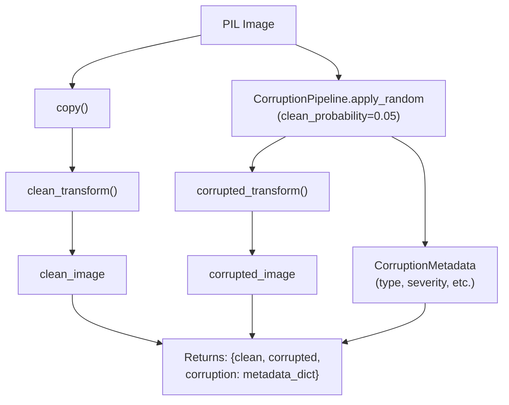

### Laundering Pipelines

Eight multi-step "laundering" pipelines simulate real-world image re-sharing:

```
clean:              (no steps)
repost_mild:        resize(0.5) → jpeg(70)
repost_aggressive:  crop(0.80) → resize(0.5) → jpeg(50)
repost_extreme:     crop(0.80) → resize(0.25) → jpeg(30)
blur_recompress:    blur(1.0) → resize(0.5) → jpeg(50)
noise_recompress:   noise(0.05) → jpeg(50)
filtered_repost:    color_jitter(0.20) → crop(0.80) → resize(0.5) → jpeg(50)
full_laundering:    crop(0.80) → blur(1.0) → resize(0.5) → color_jitter(0.20) → jpeg(30)
```

---

## 9. Training System

### Shared Training Infrastructure

All trainers share these patterns:

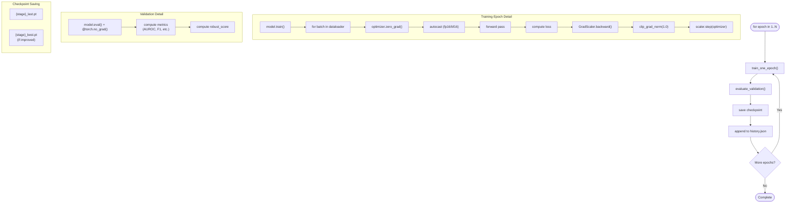

**AMP (Automatic Mixed Precision):** fp16 on CUDA, bf16 on MPS/CPU. `GradScaler` wraps backward/step.

**Gradient clipping:** `max_norm=1.0` on all trainable parameters.

**Checkpoint format:** Each stage has its own checkpoint saver that stores:
- `model_state_dict`
- `optimizer_state_dict`
- `epoch`
- `metrics`
- `config`

### Metrics (`src/training/metrics.py`)

`compute_binary_metrics` computes:

| Metric | Description |
|---|---|
| `accuracy` | Overall accuracy |
| `balanced_accuracy` | Class-balanced accuracy |
| `precision` | TP / (TP + FP) |
| `recall` | TP / (TP + FN) |
| `f1` | Harmonic mean of precision and recall |
| `auroc` | Area under ROC curve |
| `average_precision` | Area under PR curve |
| `false_positive_rate` | FP / (FP + TN) |
| `false_negative_rate` | FN / (FN + TP) |
| Confusion matrix | TN, FP, FN, TP counts |

### Stage-Specific Training Details

| Stage | Trainer | Batch Size | Epochs | Selection Metric |
|---|---|---|---|---|
| 1 Baseline | `trainer.py` | 32 | 10 | validation AUROC |
| 2 Robust | `robust_trainer.py` | 32 | 10 | robust_score (avg clean+corrupted AUROC) |
| 3 Forensic Fusion | `forensic_trainer.py` | 32 | 10 | robust_score |
| 4 Native Tile | `native_tile_trainer.py` | 16 | 10 | robust_score |
| 5 Transformation-Aware | `transformation_aware_trainer.py` | 16 | 8 | robust_score |
| Corruption Estimator | `corruption_trainer.py` | 16 | 8 | type accuracy + severity MAE |

### Corruption Target Encoding (`src/training/corruption_targets.py`)

Maps corruption metadata to normalized training targets:

```
7 corruption types → integer IDs:
  0: clean, 1: jpeg, 2: blur, 3: resize, 4: noise, 5: color_jitter, 6: crop

Severity normalization (0-1):
  clean:    0
  jpeg:     (100 - quality) / 70
  blur:     sigma / 2.0
  resize:   (1 - scale) / 0.75
  noise:    sigma / 0.10
  color:    max(|factor - 1|) / 0.20
  crop:     (1 - ratio) / 0.20
```

---

## 10. Evaluation & Robustness Benchmarking

### Corruption Robustness Benchmark (`src/evaluation/robustness.py`)

Evaluates the model under 13 corruption conditions defined in `configs/base.yaml`:

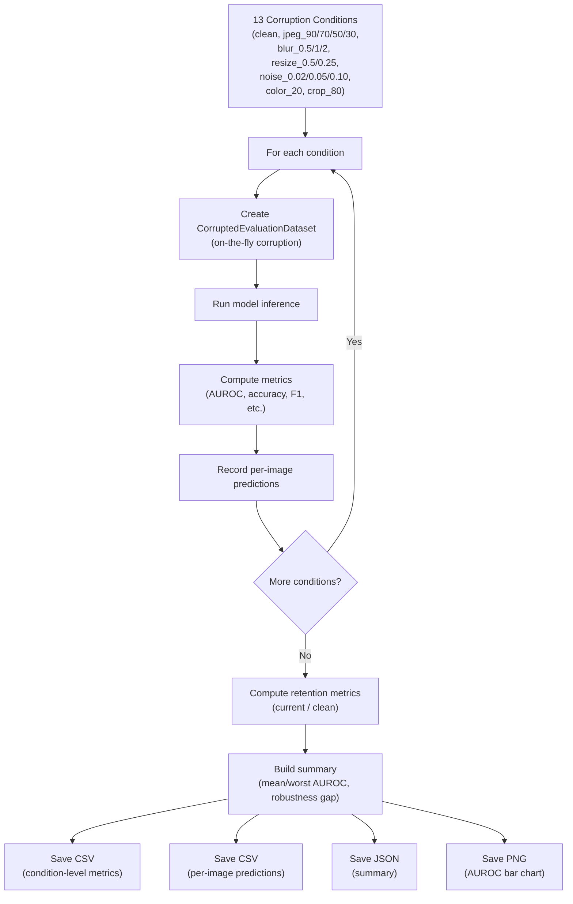

### Laundering Evaluation (`src/evaluation/laundering.py`)

Tests model resilience against multi-step laundering pipelines. For each pipeline:
1. Apply the full sequence of corruptions to each test image
2. Run the transformation-aware model with full diagnostics
3. Record: final prediction, semantic/forensic branch predictions, gate weights, predicted corruption type/severity, tile attention

### Error Analysis (`src/evaluation/error_analysis.py`)

Categorizes errors into interpretable groups:
- **Confident wrong** — prediction > 0.90 but incorrect
- **Branch disagreement** — |semantic_pred - forensic_pred| > 0.40
- **Low reliability** — reliability score < 0.50
- Generates contact sheet visualizations (4 columns, 300×330 cells)

### SID Out-of-Distribution Evaluation

`scripts/evaluate_sid_ood.py` evaluates cross-dataset generalization (train on CIFAKE, test on SID_Set) to measure real-world robustness.

---

## 11. Calibration System

### Temperature Scaling (`src/calibration/temperature_scaling.py`)

A single-parameter post-hoc calibration method:

```
calibrated_logit = raw_logit / T

T is optimized via LBFGS with strong Wolfe line search:
  minimize BCE(sigmoid(logits / T), labels)
  T clamped to [0.05, 20.0]
```

Parameterized as `log_temperature` to ensure positivity. Fitted on the validation set.

### Reliability Calibration (`src/calibration/reliability.py`)

A 9-feature logistic regression model that predicts whether a prediction will be **robustly correct** (correct under all transformation probes):

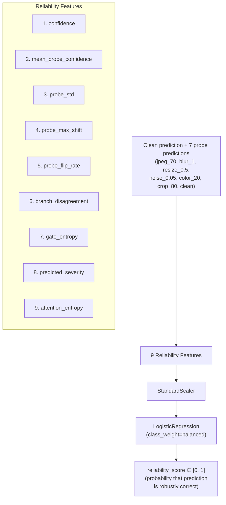

**Target definition:** A sample is "robustly correct" (target=1) if and only if the prediction is correct under **every** probe condition. This teaches the calibrator to flag predictions that might flip under transformation.

The `ReliabilityCalibrator` is serializable (`to_dict` / `from_dict`) for saving alongside the temperature scaler.

### Calibration Fitting Script

`scripts/fit_calibration.py`:
1. Runs the model on the validation set under all probe conditions
2. Collects logits, branch predictions, gate weights, attention, severity
3. Fits temperature scaler via LBFGS
4. Builds 9-feature reliability matrix
5. Fits `ReliabilityCalibrator` (StandardScaler + LogisticRegression)
6. Saves `calibration.json` with temperature + reliability coefficients

---

## 12. Inference Engine

### AIGCInferenceEngine (`src/inference/predictor.py`)

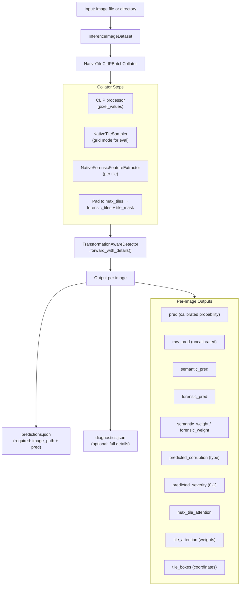

### Usage

```bash
python scripts/infer.py \
    --input samples/inference_test/ \
    --output outputs/predictions.json \
    --config configs/base.yaml \
    --checkpoint checkpoints/transformation_aware_best.pt \
    --calibration outputs/calibration/calibration.json \
    --diagnostics-output outputs/diagnostics.json
```

**Required output format** (competition-compatible):

```json
[
  {"image_path": "samples/inference_test/real.png", "pred": 0.0231},
  {"image_path": "samples/inference_test/fake.png", "pred": 0.9784}
]
```

---

## 13. Script Reference

### Data Preparation

| Script | Purpose |
|---|---|
| `build_cifake_manifest.py` | Scan CIFAKE directories, build train/val/test CSVs |
| `build_sid_manifest.py` | Stream SID_Set from HuggingFace, materialize images, build CSVs |
| `build_sid_partitions.py` | Create OOD partitions for cross-dataset evaluation |
| `build_unified_manifest.py` | Merge CIFAKE + SID manifests into a unified manifest |
| `download_sid_subset.py` | Download a small SID subset for quick testing |
| `inspect_dataset.py` | Inspect dataset statistics and class distributions |
| `inspect_sid_manifest.py` | Inspect SID manifest for issues |

### Training (sequential order)

| Script | Stage | Warm-start |
|---|---|---|
| `train_baseline.py` | Stage 1: Baseline | — |
| `train_robust.py` | Stage 2: Robust | baseline_best.pt |
| `train_forensic_fusion.py` | Stage 3: Forensic Fusion | robust_best.pt |
| `train_native_tile_fusion.py` | Stage 4: Native Tile Fusion | forensic_fusion_best.pt |
| `train_corruption_estimator.py` | Corruption Estimator | native_tile_best.pt |
| `train_transformation_aware.py` | Stage 5: Transformation-Aware | native_tile_best.pt + corruption_estimator_best.pt |

### Evaluation

| Script | Purpose |
|---|---|
| `evaluate_baseline.py` | Evaluate baseline on clean + corrupted conditions |
| `evaluate_robust.py` | Robustness benchmark for robust detector |
| `evaluate_forensic_fusion.py` | Evaluate forensic fusion with branch diagnostics |
| `evaluate_native_tile.py` | Evaluate native tile fusion with attention visualization |
| `evaluate_transformation_aware.py` | Full evaluation of Stage 5 with all diagnostics |
| `evaluate_calibration.py` | Evaluate calibration (ECE, reliability diagrams) |
| `evaluate_laundering.py` | Test against multi-step laundering pipelines |
| `evaluate_sid_ood.py` | Cross-dataset OOD evaluation on SID_Set |
| `analyze_errors.py` | Categorize errors and generate contact sheets |

### Calibration

| Script | Purpose |
|---|---|
| `fit_calibration.py` | Fit temperature scaler + reliability calibrator |

### Inference

| Script | Purpose |
|---|---|
| `infer.py` | Run detection on an image or directory |

### Visualization & Testing

| Script | Purpose |
|---|---|
| `visualize_corruptions.py` | Visualize each corruption type at various severities |
| `visualize_forensic_features.py` | Visualize FFT/DCT/wavelet/residual maps |
| `visualize_native_tiles.py` | Visualize tile sampling (grid + random) |
| `visualize_tile_attention.py` | Overlay attention weights on image tiles |
| `test_baseline_model.py` | Quick model sanity check |
| `test_corruptions.py` | Test corruption pipeline outputs |
| `test_dataloader.py` | Test data loading + collation |
| `test_native_tiles.py` | Test tile sampling logic |
| `test_paired_views.py` | Test paired view generation |

---

## 14. Dependencies

```
torch>=2.4              # Deep learning framework
torchvision>=0.19       # Image utilities
transformers>=4.45      # CLIP model loading (HuggingFace)
datasets                # HuggingFace dataset streaming
huggingface-hub         # HuggingFace Hub access
pyarrow                 # Parquet reading for SID_Set
pillow>=10.0            # Image I/O and manipulation
numpy>=1.26             # Numerical operations
pandas>=2.2             # Manifest/DataFrame handling
scikit-learn>=1.5       # Metrics, train_test_split, LogisticRegression
pyyaml>=6.0             # Config file parsing
tqdm>=4.66              # Progress bars
matplotlib>=3.9         # Plot generation
opencv-python>=4.10     # Image processing (auxiliary)
scipy>=1.14             # Scientific computing
pywavelets>=1.7         # Wavelet transforms
safetensors>=0.4        # Safe tensor serialization
```

Install:

```bash
pip install -r requirements.txt
```

---

## Quick Start: Full Pipeline

```bash
# 1. Prepare data
python scripts/build_cifake_manifest.py
python scripts/build_sid_manifest.py

# 2. Progressive training (each stage warm-starts the next)
python scripts/train_baseline.py
python scripts/train_robust.py
python scripts/train_forensic_fusion.py
python scripts/train_native_tile_fusion.py
python scripts/train_corruption_estimator.py
python scripts/train_transformation_aware.py

# 3. Calibrate
python scripts/fit_calibration.py

# 4. Evaluate
python scripts/evaluate_transformation_aware.py
python scripts/evaluate_laundering.py
python scripts/evaluate_sid_ood.py

# 5. Inference
python scripts/infer.py \
    --input path/to/images/ \
    --output outputs/predictions.json \
    --diagnostics-output outputs/diagnostics.json
```

---

## Technical Design Notes

### Why Frozen CLIP?

CLIP's vision encoder provides rich semantic embeddings trained on 400M image-text pairs. Freezing it:
- Prevents catastrophic forgetting of semantic knowledge
- Reduces trainable parameters by ~300M
- Enables training on single GPUs
- Allows the adapter to learn task-specific adjustments

### Why Paired-View Consistency?

Real-world AIGC images are rarely pristine—they're screenshotted, re-posted, JPEG-compressed, and resized. By training on clean/corrupted pairs with consistency losses, the model learns to produce **stable predictions regardless of transformation**, which is the core robustness objective.

### Why Native Tiles?

AI-generated images often contain localized artifacts (e.g., inconsistent textures in one region, frequency artifacts in another). Whole-image processing averages these away. Per-tile analysis with learned attention lets the model **focus on the most diagnostic regions**.

### Why Corruption Estimation + Reliability Gate?

Different corruptions degrade different branches differently:
- JPEG compression destroys frequency-domain forensic features
- Heavy blur degrades both semantic and forensic signals
- Color jitter barely affects forensic features

The **corruption estimator** identifies what type of degradation is present, and the **reliability gate** uses this information to dynamically weight semantic vs. forensic branches for each individual image.

### Why Residual Adaptive Correction?

Starting with `adaptive_scale = 0.05` ensures the adaptive path contributes only a small correction at the beginning of Stage 5 training, preserving the strong performance of the Stage 4 base detector. As training progresses, the scale can grow if the adaptive path proves useful, but it cannot destroy the base detector's capabilities early in training.