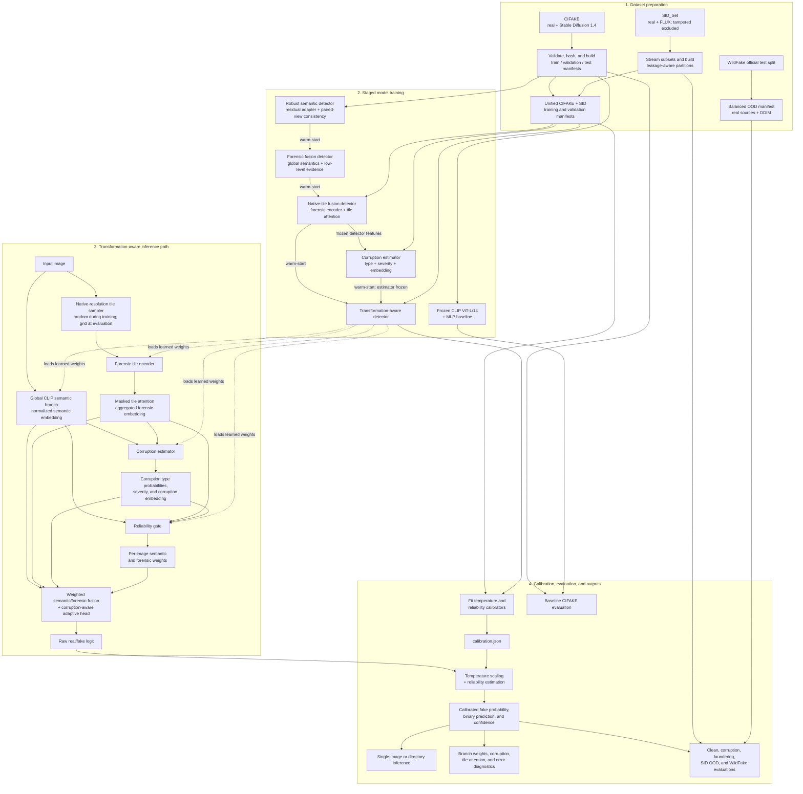

# Robust AIGC Image Detector

> **Labels:** `0` = real image · `1` = AI-generated image

A research-oriented binary image classifier for distinguishing real images from AI-generated images under clean and degraded conditions. The project begins with a reproducible frozen-CLIP baseline and develops it into a transformation-aware detector that combines global semantic evidence, local forensic evidence, corruption estimation, adaptive branch weighting, and probability calibration.

---

## Table of Contents

- [Project Overview](#project-overview)
  - [End-to-End Workflow](#end-to-end-workflow)
  - [Datasets](#datasets)
  - [Repository Structure](#repository-structure)
- [Evaluation Results](#evaluation-results)
  - [Clean CIFAKE Test Set](#clean-cifake-test-set)
  - [Corruption Stress Test](#corruption-stress-test)
- [Setup and Installation](#setup-and-installation)
  - [Prerequisites](#prerequisites)
  - [Create an Environment](#create-an-environment)
  - [Prepare CIFAKE](#prepare-cifake)
  - [Prepare Optional OOD Datasets](#prepare-optional-ood-datasets)
- [Reproducing the Reported Baseline Result](#reproducing-the-reported-baseline-result)
- [Reproducing the Full Robustness Pipeline](#reproducing-the-full-robustness-pipeline)
  - [Training](#training)
  - [Evaluation](#evaluation-1)
  - [Inference](#inference)
- [Limitations and Future Improvements](#limitations-and-future-improvements)
  - [Dataset Scale and Runtime](#dataset-scale-and-runtime)
  - [Data and Evaluation Coverage](#data-and-evaluation-coverage)
  - [Given More Time](#given-more-time)
- [Configuration and Reproducibility Notes](#configuration-and-reproducibility-notes)
- [Technical Reference](#technical-reference)

---

## Project Overview

AI-image detectors often perform well on the dataset used for training but fail on unseen generators or after ordinary transformations such as JPEG compression, resizing, blur, noise, cropping, and colour changes. This project is designed to measure and improve that robustness.

The solution is developed in stages:

| # | Stage | Description |
|:---:|---|---|
| 1 | **Frozen-CLIP baseline** | Extracts normalized image embeddings with `openai/clip-vit-large-patch14` and trains a small MLP classifier. |
| 2 | **Robust semantic detector** | Adds a residual adapter and paired clean/corrupted-view consistency training. |
| 3 | **Forensic fusion** | Combines CLIP semantics with learned low-level forensic features. |
| 4 | **Native-resolution tile fusion** | Samples local tiles before resizing, encodes them with a forensic branch, and learns attention over the most useful regions. |
| 5 | **Transformation-aware detector** | Estimates corruption type and severity, then uses a reliability gate to adapt the semantic/forensic contribution for each image. |
| 6 | **Calibration and diagnostics** | Applies temperature scaling, estimates prediction reliability, and exports branch, gating, tile-attention, and error-analysis data. |

### End-to-End Workflow



> Solid arrows show data or prediction flow; dashed arrows show the trained transformation-aware checkpoint supplying weights to the runtime branches. The staged checkpoints are deliberately ordered: **robust semantic → forensic fusion → native-tile fusion → corruption estimator → transformation-aware detector**.

### Datasets

| Dataset | Role | Details |
|---|---|---|
| [CIFAKE](https://www.kaggle.com/datasets/birdy654/cifake-real-and-ai-generated-synthetic-images) | In-domain training & testing | 120,000 balanced 32 × 32 images: CIFAR-10 real + Stable Diffusion 1.4 synthetic |
| [SID_Set](https://huggingface.co/datasets/saberzl/SID_Set) | Higher-res training & OOD evaluation | Includes unseen FLUX-generated images. Label `2` (tampered) is excluded from the binary task. |
| [WildFake](https://ojs.aaai.org/index.php/AAAI/article/view/32363) | Cross-dataset & cross-generator evaluation | 2,557,278 fake + 1,013,446 real (3,570,724 total) across GAN, diffusion, and other generator families |

### Repository Structure

```text
configs/       Experiment configuration and hyperparameters
data/          Dataset manifests; raw/processed images are Git-ignored
scripts/       Dataset, training, evaluation, calibration, inference, and visualization entry points
src/           Models, data loaders, augmentations, training, evaluation, calibration, and inference code
checkpoints/   Generated model checkpoints (Git-ignored)
outputs/       Generated metrics, predictions, plots, and diagnostics (Git-ignored)
samples/       Example real/fake images for local inference
```

---

## Evaluation Results

> The following results are taken from the evaluation artifacts produced by this project after training on the intended dataset splits. The repository copy is intentionally lightweight and does not include every raw training dataset. Unless otherwise stated, the decision threshold is `0.5` and the seed is `42`.

### Clean CIFAKE Test Set

The frozen-CLIP baseline was evaluated on all 20,000 CIFAKE test images (10,000 real and 10,000 fake).

| Metric | Result |
|---|---:|
| Accuracy | 97.45% |
| Balanced accuracy | 97.45% |
| Precision | 98.08% |
| Recall | 96.79% |
| F1 score | 97.43% |
| AUROC | 99.69% |
| Average precision | 99.70% |
| False-positive rate | 1.89% |
| False-negative rate | 3.21% |

The corresponding confusion matrix:

| | Predicted Real | Predicted Fake |
|---|---:|---:|
| **Actual Real** | 9,811 (TN) | 189 (FP) |
| **Actual Fake** | 321 (FN) | 9,679 (TP) |

Full metrics and per-image predictions are written to `outputs/evaluation/baseline_clean_metrics.json` and `outputs/evaluation/baseline_clean_predictions.csv`.

### Corruption Stress Test

<callout accent="#f59e0b">
An earlier balanced 256-image diagnostic benchmark illustrates how strongly the clean baseline depends on image quality. Because this is a small smoke-test subset, it should not be treated as a full-dataset confidence estimate.
</callout>

| Condition | Accuracy | F1 | AUROC | AUROC retained vs. clean |
|---|---:|---:|---:|---:|
| Clean | 97.66% | 97.66% | 99.65% | 100.00% |
| JPEG quality 30 | 89.06% | 88.33% | 97.21% | 97.56% |
| Gaussian blur, σ = 2 | 57.81% | 28.00% | 73.88% | 74.14% |
| Resize to 25% | 55.86% | 23.13% | 72.31% | 72.57% |

Across the three corrupted conditions:

| Aggregate | Value |
|---|---:|
| Mean AUROC | 81.14% |
| Mean accuracy | 67.58% |
| Mean AUROC retention | 81.42% |

Resizing to 25% was the worst condition. These results motivate the paired-corruption training, native-tile forensic branch, and transformation-aware reliability gate used in the later stages.

---

## Setup and Installation

### Prerequisites

- **Python** 3.10 or newer
- **Git**
- **Internet access** for datasets and the first download of the CLIP backbone
- A **CUDA-capable GPU** is strongly recommended for training; CPU execution is supported by the device-selection code but will be considerably slower
- **Sufficient storage** for the selected datasets, checkpoints, and generated predictions

### Create an Environment

Run all commands from the repository root.

```powershell
python -m venv .venv
.\.venv\Scripts\Activate.ps1
python -m pip install --upgrade pip
python -m pip install -r requirements.txt
```

> On macOS or Linux, activate the environment with `source .venv/bin/activate` instead.

The ModelScope Hub client required by the optional WildFake selective downloader is included in `requirements.txt`.

If a specific CUDA build of PyTorch is required, install the appropriate build using the [official PyTorch selector](https://pytorch.org/get-started/locally/) before installing the remaining requirements.

### Prepare CIFAKE

Download CIFAKE from Kaggle and extract it into the following layout:

```text
data/raw/CIFAKE/
├── train/
│   ├── REAL/
│   └── FAKE/
└── test/
    ├── REAL/
    └── FAKE/
```

Directory matching is case-insensitive. Build the deterministic manifests with:

```powershell
python scripts/build_cifake_manifest.py
```

With the default configuration, this creates a class-balanced split of:

| Split | Images |
|---|---:|
| Training | 90,000 |
| Validation | 10,000 |
| Test | 20,000 |

The manifest builder validates images, records dimensions and SHA-256 hashes, and reports exact duplicates.

### Prepare Optional OOD Datasets

**SID validation subset** (4,000 images, 2,000 per class):

```powershell
python scripts/download_sid_subset.py --splits validation --val-per-class 2000
```

**Complete staged training workflow** — download both configured SID subsets, then construct leakage-aware model-development partitions and unified manifests:

```powershell
python scripts/download_sid_subset.py
python scripts/build_sid_partitions.py
python scripts/build_unified_manifest.py
```

The default SID download materializes **8,000 training** and **2,000 validation** images per class while preserving original encoded bytes.

**WildFake** — the downloader selects 5,000 real and 5,000 DDIM images from the official test annotation and extracts only those images from four source archives:

```powershell
python scripts/download_wildfake_subset.py
python scripts/build_wildfake_manifest.py --split test --max-real 500 --max-fake 500 --max-per-generator 500
```

The second command reproduces the balanced 1,000-image evaluation manifest: 500 DDIM images and 500 real images sampled from AFHQ, LSUN Church, and FFHQ. Use `--dry-run` on the downloader to inspect the selection and archive plan before transferring large files.

> Raw data is intentionally excluded from Git. Anyone reproducing the project must obtain the datasets under their respective licenses and terms.

---

## Reproducing the Reported Baseline Result

After installing the dependencies and preparing CIFAKE:

### 1. Confirm manifest sizes

```powershell
python scripts/inspect_dataset.py data/manifests/cifake_train.csv
python scripts/inspect_dataset.py data/manifests/cifake_test.csv
```

### 2. Train the frozen-CLIP classifier

Using the defaults in `configs/base.yaml` (seed 42, batch size 32, 10 epochs):

```powershell
python scripts/train_baseline.py
```

The best and final checkpoints are saved as `checkpoints/baseline_best.pt` and `checkpoints/baseline_last.pt`.

### 3. Evaluate the best checkpoint

```powershell
python scripts/evaluate_baseline.py
```

### 4. Compare results

Compare `outputs/evaluation/baseline_clean_metrics.json` with the [clean-test table above](#clean-cifake-test-set). Small numeric differences can occur across PyTorch/CUDA versions and GPU architectures despite deterministic seeding.

> The earlier 256-image corruption table is retained as a diagnostic artifact, whereas the clean 20,000-image result is the primary directly reproducible result.

---

## Reproducing the Full Robustness Pipeline

The advanced models are warm-started in sequence, so run the stages in this order after preparing CIFAKE and the SID unified manifests:

### Training

```powershell
python scripts/train_robust.py
python scripts/train_forensic_fusion.py
python scripts/train_native_tile_fusion.py
python scripts/train_corruption_estimator.py
python scripts/train_transformation_aware.py
python scripts/fit_calibration.py
```

### Evaluation

```powershell
python scripts/evaluate_transformation_aware.py
python scripts/evaluate_calibration.py
python scripts/evaluate_laundering.py
python scripts/evaluate_wildfake_zero_shot.py
```

Each command reads its default input checkpoint from the previous stage. Evaluation CSV/JSON files are written below `outputs/evaluation/`, and calibration artifacts are written below `outputs/calibration/`.

### Inference

Once `transformation_aware_best.pt` and `calibration.json` exist, run inference on one image or an entire directory:

```powershell
python scripts/infer.py `
  --input samples/inference_test `
  --output outputs/inference/predictions.json `
  --diagnostics-output outputs/inference/diagnostics.json
```

---

## Limitations and Future Improvements

### Dataset Scale and Runtime

Dataset size was the dominant constraint. The portable workspace retained for review contains approximately:

| Dataset | Images | Storage |
|---|---:|---:|
| CIFAKE (all) | 120,000 | ~0.10 GiB |
| SID validation subset | 4,000 | ~2.70 GiB |
| WildFake (downloaded) | 10,000 + metadata | ~0.58 GiB |

These storage figures describe only the files currently available in the review copy; training was completed using the intended dataset volumes before the larger data files were omitted from the repository.

WildFake is the main scaling challenge: its paper reports **3.57 million images**, roughly 30 times the number of CIFAKE images used here. The selective downloader therefore restricts fake data to DDIM and real data to three sources. Although only 10,000 images are retained locally and 1,000 are placed in the evaluation manifest, the downloader must still transfer the four complete ZIP archives containing those selected images.

> **Download time rule of thumb:** each 100 GB takes about 2.2 hours at a sustained 100 Mbps, and each 1 TB takes about 22 hours, before extraction, validation, or retries.

No hardware-normalized timing log is included in the portable repository, so this README does not claim a fixed number of training hours. The baseline alone processes 90,000 images for 10 epochs — approximately 28,130 optimizer steps at batch size 32. A single 10-epoch pass over all 3.57 million WildFake images would expose the model to about 40 times more images per epoch than the baseline. The complete detector is more expensive again because it uses paired clean/corrupted views, multiple native-resolution tiles, a forensic encoder, and five sequential learned stages totaling 46 configured epochs. Full-scale retraining would require substantially more storage, data-loader throughput, GPU memory, and likely multi-GPU distributed training.

### Data and Evaluation Coverage

- **Narrow training domain:** CIFAKE images are only 32 × 32 and its fake class comes from Stable Diffusion 1.4. High clean accuracy may reflect dataset- or generator-specific cues rather than universal synthetic-image evidence.
- **Known duplicate leakage:** the manifest audit found 378 exact content hashes appearing in both CIFAKE's original training and test folders (756 rows in the report). They are reported in `data/manifests/cifake_cross_split_duplicates.csv` but are not removed by the current builder, so the clean metric may be mildly optimistic.
- **Small OOD subsets:** SID evaluation uses 4,000 images, while the WildFake manifest uses only 1,000 images and one fake architecture (DDIM). This is useful for hackathon-scale testing but does not represent WildFake's full hierarchy or generator diversity.
- **Synthetic corruptions:** JPEG, blur, resize, noise, colour, and crop pipelines approximate common reposting behaviour but cannot capture every social-media codec, screenshot workflow, watermark, filter, or adversarial manipulation.
- **Binary scope:** tampered/partially edited images are excluded, and the system predicts authenticity rather than identifying the responsible generator or providing provenance.
- **Calibration drift:** a threshold and temperature fitted on one distribution may be unreliable for new generators, cameras, platforms, or compression pipelines. The output should be treated as decision support, not proof of authenticity.

### Given More Time

The next priorities would be to:

1. **Remove all hash overlap** before splitting
2. **Benchmark the complete pipeline** on fixed hardware with download, preprocessing, training, and inference timings
3. **Expand WildFake coverage** across GAN, diffusion, and other generator families
4. **Report confidence intervals** and per-source metrics on larger held-out sets
5. **Scale the input pipeline** with sharded/streaming storage, cached CLIP embeddings where valid, distributed mixed-precision training, and resumable dataset downloads
6. **Add real social-media laundering data**, newer generators, tampered images, ablation studies for each branch, and continuous calibration monitoring under domain shift

---

## Configuration and Reproducibility Notes

All primary hyperparameters, paths, corruption conditions, and seed values are centralized in `configs/base.yaml`. Checkpoints, raw datasets, processed images, and generated outputs are Git-ignored by design.

> Preserve the exact configuration, manifest hashes, dependency versions, checkpoint, and hardware details when comparing runs.

---

## Technical Reference

For a deeper dive into the model architecture, forensic feature extraction, loss functions, training infrastructure, and inference internals, see [README_detailed.md](README_detailed.md). It covers:

- Per-stage architecture diagrams (Mermaid) for all 5 model stages
- Forensic feature extraction pipeline (FFT, DCT, wavelet, high-pass residual)
- Augmentation & corruption pipeline details (6 corruption types, 8 laundering pipelines)
- Training system internals (loss functions, differential learning rates, checkpoint formats)
- Evaluation & robustness benchmarking methodology
- Calibration system (temperature scaling, 9-feature reliability calibrator)
- Inference engine output format and diagnostics
- Full script reference table (35 scripts)
- Technical design rationale (why frozen CLIP, why paired-view consistency, why native tiles, etc.)
